<div align="center">

<!-- HEADER -->


<!-- TYPING SVG -->
<a href="https://git.io/typing-svg"></a>

</div>

<!-- SNAKE -->
<div align="center">

<picture>
  <source media="(prefers-color-scheme: dark)" srcset="https://raw.githubusercontent.com/wowitsjack/wowitsjack/output/github-snake-dark.svg" />
  <source media="(prefers-color-scheme: light)" srcset="https://raw.githubusercontent.com/wowitsjack/wowitsjack/output/github-snake.svg" />
  
</picture>

</div>

<!-- ABOUT -->
<div align="center">

```
 ╔══════════════════════════════════════════════════════════════════╗
 ║                                                                  ║
 ║  > whoami                                                        ║
 ║                                                                  ║
 ║    jack. i break things, fix things, and build things.           ║
 ║    security research, hardware hacking, forensic recovery,       ║
 ║    kernel patches, android modding, and whatever else looks      ║
 ║    interesting. brisbane, australia.                              ║
 ║                                                                  ║
 ╚══════════════════════════════════════════════════════════════════╝
```

</div>

<!-- STATS -->
<div align="center">


&nbsp;&nbsp;


</div>

<!-- STREAK -->
<div align="center">


</div>

---

<!-- TECH -->
<div align="center">

### `> cat /proc/skills`


</div>

---

<!-- PROJECTS -->
<div align="center">

### `> ls ~/projects`

</div>

<table align="center">
<tr>
<td width="50%" valign="top">

<h3 align="center">🚂 choochoo-loader</h3>
<p align="center">
<a href="https://github.com/wowitsjack/choochoo-loader">

</a>
</p>
<p align="center">trainer/cheat loader for Proton and WINE gaming setups. works on Steam Deck, SteamOS, macOS, and Linux.</p>
<p align="center">


</p>

</td>
<td width="50%" valign="top">

<h3 align="center">🔓 freeMarkable</h3>
<p align="center">
<a href="https://github.com/wowitsjack/freeMarkable">

</a>
</p>
<p align="center">jailbreak toolkit for reMarkable 1, 2, and Paper Pro. root access, custom launchers, the works.</p>
<p align="center">


</p>

</td>
</tr>
<tr>
<td width="50%" valign="top">

<h3 align="center">🎯 Hitman Peacock SteamDeck</h3>
<p align="center">
<a href="https://github.com/wowitsjack/Hitman-Peacock-SteamDeck">

</a>
</p>
<p align="center">launcher for the Steam Deck/SteamOS. easy and functional launching of the Peacock HITMAN server emulator.</p>
<p align="center">


</p>

</td>
<td width="50%" valign="top">

<h3 align="center">👁️ ALLSEEINGEYE</h3>
<p align="center">
<a href="https://github.com/wowitsjack/ALLSEEINGEYE">

</a>
</p>
<p align="center">internet-wide surveillance and enumeration toolkit.</p>
<p align="center">


</p>

</td>
</tr>
</table>

---

<div align="center">


```
 GAME OVER
 INSERT COIN TO CONTINUE
```

</div>
